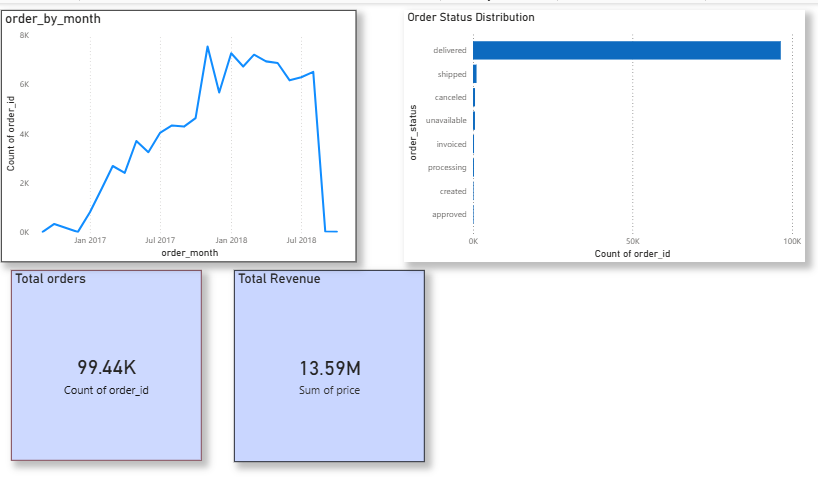

# list Ecommerce Sales Analysis

##  Project Overview

This project analyzes the Brazilian Olist ecommerce dataset to understand sales performance, customer behavior, delivery efficiency, and seller contribution.

The goal of this project is to extract meaningful business insights using **Python (Pandas)** and create an interactive **Power BI dashboard** for decision making.

---

## Dataset

The dataset contains real ecommerce transactional data including:

* Customers information
* Orders and order status
* Order payments
* Order reviews
* Products and sellers
* Geolocation data

---

## Tools & Technologies Used

* Python
* Pandas
* NumPy
* Matplotlib / Seaborn
* Power BI
* Git & GitHub

---

## Key Analysis Performed

* Order status distribution analysis
* Monthly sales trend analysis
* Top performing sellers identification
* Product category revenue contribution
* Delivery time analysis
* Customer review score analysis

---

## Dashboard Insights

* Identified peak sales months
* Found sellers generating highest revenue
* Observed delivery delays patterns
* Analyzed customer satisfaction trends

---

Dashboard Preview

 Project Structure
dashboard/     → Power BI dashboard file  
data/          → Raw and cleaned datasets  
notebooks/     → Data analysis notebook  
README.md      → Project documentation  

 Conclusion

This project demonstrates end-to-end data analysis workflow including:

✔ Data cleaning
✔ Exploratory data analysis
✔ Business insight generation
✔ Data visualization
✔ Dashboard creation

 Author

Bhumika Bhatt
Aspiring Data Analyst